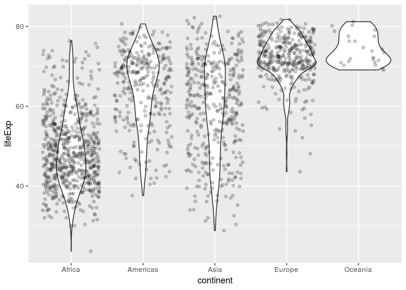

Gapminder Exploration
================

First, we load the `gapminder` and `tidyverse` packages:

``` r
library(gapminder)
library(tidyverse)
```

    ## Warning: replacing previous import by 'tibble::as_tibble' when loading
    ## 'broom'

    ## Warning: replacing previous import by 'tibble::tibble' when loading 'broom'

    ## ── Attaching packages ──────────────────────────────────────────────────────────────────────────────────────────────────── tidyverse 1.2.1 ──

    ## ✔ ggplot2 3.0.0     ✔ purrr   0.2.5
    ## ✔ tibble  1.4.2     ✔ dplyr   0.7.6
    ## ✔ tidyr   0.8.1     ✔ stringr 1.3.1
    ## ✔ readr   1.1.1     ✔ forcats 0.3.0

    ## ── Conflicts ─────────────────────────────────────────────────────────────────────────────────────────────────────── tidyverse_conflicts() ──
    ## ✖ dplyr::filter() masks stats::filter()
    ## ✖ dplyr::lag()    masks stats::lag()

Next, we will "smell test" the data:

Is it a data.frame, a matrix, a vector, a list?

``` r
typeof(gapminder)
```

    ## [1] "list"

As we can see, `gapminder` is stored in a list.

What is its class?

``` r
class(gapminder)
```

    ## [1] "tbl_df"     "tbl"        "data.frame"

`gapminder` belongs to the classes `tibble` and `data.frame`.

How many variables/columns?

``` r
ncol(gapminder)
```

    ## [1] 6

`gapminder` has 6 columns.

How many rows/observations?

``` r
nrow(gapminder)
```

    ## [1] 1704

There are 1704 observations in `gapminder`

Can you get these facts about "extent" or "size" in more than one way? Can you imagine different functions being useful in different contexts?

``` r
names(gapminder)
```

    ## [1] "country"   "continent" "year"      "lifeExp"   "pop"       "gdpPercap"

This can also be used to find the number of columns in a dataset

What data type is each variable?

``` r
str(gapminder)
```

    ## Classes 'tbl_df', 'tbl' and 'data.frame':    1704 obs. of  6 variables:
    ##  $ country  : Factor w/ 142 levels "Afghanistan",..: 1 1 1 1 1 1 1 1 1 1 ...
    ##  $ continent: Factor w/ 5 levels "Africa","Americas",..: 3 3 3 3 3 3 3 3 3 3 ...
    ##  $ year     : int  1952 1957 1962 1967 1972 1977 1982 1987 1992 1997 ...
    ##  $ lifeExp  : num  28.8 30.3 32 34 36.1 ...
    ##  $ pop      : int  8425333 9240934 10267083 11537966 13079460 14880372 12881816 13867957 16317921 22227415 ...
    ##  $ gdpPercap: num  779 821 853 836 740 ...

Pick at least one categorical variable and at least one quantitative variable to explore.

categorical variable selected: continent quantitative variable selected: pop

What are possible values (or range, whichever is appropriate) of each variable?

``` r
summary(gapminder$continent)
```

    ##   Africa Americas     Asia   Europe  Oceania 
    ##      624      300      396      360       24

``` r
ggplot(gapminder, aes(continent)) + geom_bar()
```


``` r
ggplot(gapminder, aes(gdpPercap)) + geom_density(bw = 0.05, fill = "orange") + scale_x_log10()
```


``` r
plot = ggplot(gapminder, aes(gdpPercap, lifeExp)) + scale_x_log10()
plot + geom_point(aes(colour = factor(continent)), size = 2)
```


What values are typical? What's the spread? What's the distribution? Etc., tailored to the variable at hand. Feel free to use summary stats, tables, figures. We're NOT expecting high production value (yet).

Typical values of continent are the five continents: Africa, Americas, Asia, Europe, and Oceania. Note that North, Central, and South America are all mixed into one group.

``` r
a = ggplot(gapminder, aes(continent, pop)) + scale_y_log10()
a+geom_violin()+geom_jitter(alpha=0.2)
```


``` r
gapminder %>% 
  filter(country == 'Germany') %>% 
  ggplot(aes(gdpPercap, lifeExp)) + geom_point() + geom_line(arrow=arrow())
```


