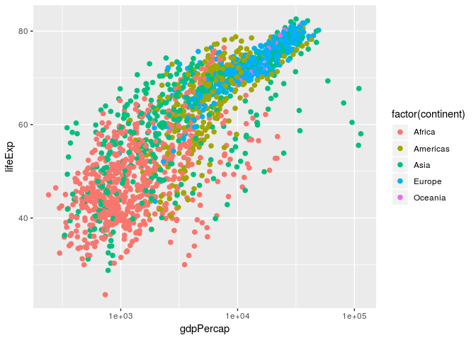

Gapminder Exploration
================

First, we load the `gapminder` and `tidyverse` packages:

``` r
library(gapminder)
library(tidyverse)
```

    ## Warning: replacing previous import by 'tibble::as_tibble' when loading
    ## 'broom'

    ## Warning: replacing previous import by 'tibble::tibble' when loading 'broom'

    ## ── Attaching packages ─────────────────────────────────────────────────────────────────────────── tidyverse 1.2.1 ──

    ## ✔ ggplot2 3.0.0     ✔ purrr   0.2.5
    ## ✔ tibble  1.4.2     ✔ dplyr   0.7.6
    ## ✔ tidyr   0.8.1     ✔ stringr 1.3.1
    ## ✔ readr   1.1.1     ✔ forcats 0.3.0

    ## ── Conflicts ────────────────────────────────────────────────────────────────────────────── tidyverse_conflicts() ──
    ## ✖ dplyr::filter() masks stats::filter()
    ## ✖ dplyr::lag()    masks stats::lag()

Smell Test:
-----------

Is it a data.frame, a matrix, a vector, a list?

``` r
typeof(gapminder)
```

    ## [1] "list"

As we can see, `gapminder` is stored in a list.

What is its class?

``` r
class(gapminder)
```

    ## [1] "tbl_df"     "tbl"        "data.frame"

`gapminder` belongs to the classes `tibble` and `data.frame`.

How many variables/columns?

``` r
ncol(gapminder)
```

    ## [1] 6

`gapminder` has 6 columns.

How many rows/observations?

``` r
nrow(gapminder)
```

    ## [1] 1704

There are 1704 observations in `gapminder`

Can you get these facts about "extent" or "size" in more than one way? Can you imagine different functions being useful in different contexts?

``` r
names(gapminder)
```

    ## [1] "country"   "continent" "year"      "lifeExp"   "pop"       "gdpPercap"

This can also be used to find the number of columns in a dataset

What data type is each variable?

``` r
str(gapminder)
```

    ## Classes 'tbl_df', 'tbl' and 'data.frame':    1704 obs. of  6 variables:
    ##  $ country  : Factor w/ 142 levels "Afghanistan",..: 1 1 1 1 1 1 1 1 1 1 ...
    ##  $ continent: Factor w/ 5 levels "Africa","Americas",..: 3 3 3 3 3 3 3 3 3 3 ...
    ##  $ year     : int  1952 1957 1962 1967 1972 1977 1982 1987 1992 1997 ...
    ##  $ lifeExp  : num  28.8 30.3 32 34 36.1 ...
    ##  $ pop      : int  8425333 9240934 10267083 11537966 13079460 14880372 12881816 13867957 16317921 22227415 ...
    ##  $ gdpPercap: num  779 821 853 836 740 ...

Exploring individual variables
------------------------------

Pick at least one categorical variable and at least one quantitative variable to explore.

categorical variable selected: continent quantitative variable selected: lifeExp

What are possible values (or range, whichever is appropriate) of each variable?

``` r
summary(gapminder$continent)
```

    ##   Africa Americas     Asia   Europe  Oceania 
    ##      624      300      396      360       24

The same information, in bar chart form:

``` r
ggplot(gapminder, aes(continent)) + geom_bar(fill = 'dark green')
```


``` r
summary(gapminder$lifeExp)
```

    ##    Min. 1st Qu.  Median    Mean 3rd Qu.    Max. 
    ##   23.60   48.20   60.71   59.47   70.85   82.60

When we have a continuous variable we get more information from a density plot vs. the summary statistics.

``` r
ggplot(gapminder, aes(lifeExp)) + geom_density(bw = 0.01, fill = "orange") + scale_x_log10()
```


As expected, we have a large group of countries in the 70s for life expectancy, presumably the Western (i.e. developed) countries.
----------------------------------------------------------------------------------------------------------------------------------

A fancier plot,

``` r
plot = ggplot(gapminder, aes(gdpPercap, lifeExp)) + scale_x_log10()
plot + geom_point(aes(colour = factor(continent)), size = 2)
```



What values are typical? What's the spread? What's the distribution? Etc., tailored to the variable at hand. Feel free to use summary stats, tables, figures. We're NOT expecting high production value (yet).

Typical values of continent are the five continents: Africa, Americas, Asia, Europe, and Oceania. Note that North, Central, and South America are all mixed into one group.

``` r
a = ggplot(gapminder, aes(continent, pop)) + scale_y_log10()
a+geom_violin()+geom_jitter(alpha=0.2)
```


``` r
gapminder %>% 
  filter(country == 'Germany') %>% 
  ggplot(aes(gdpPercap, lifeExp)) + geom_point() + geom_line(arrow=arrow())
```


Evaluate this code and describe the result. Presumably the analyst's intent was to get the data for Rwanda and Afghanistan. Did they succeed? Why or why not? If not, what is the correct way to do this?

code: `filter(gapminder, country == c("Rwanda", "Afghanistan"))`

The problem with this code is that none of the country entires are a list containing "Rwanda" then "Afghanistan" in that order. To filter to Rwanda and Afghanistan, we use the following code:

``` r
filter(gapminder, country %in% c("Rwanda", "Afghanistan"))
```

    ## # A tibble: 24 x 6
    ##    country     continent  year lifeExp      pop gdpPercap
    ##    <fct>       <fct>     <int>   <dbl>    <int>     <dbl>
    ##  1 Afghanistan Asia       1952    28.8  8425333      779.
    ##  2 Afghanistan Asia       1957    30.3  9240934      821.
    ##  3 Afghanistan Asia       1962    32.0 10267083      853.
    ##  4 Afghanistan Asia       1967    34.0 11537966      836.
    ##  5 Afghanistan Asia       1972    36.1 13079460      740.
    ##  6 Afghanistan Asia       1977    38.4 14880372      786.
    ##  7 Afghanistan Asia       1982    39.9 12881816      978.
    ##  8 Afghanistan Asia       1987    40.8 13867957      852.
    ##  9 Afghanistan Asia       1992    41.7 16317921      649.
    ## 10 Afghanistan Asia       1997    41.8 22227415      635.
    ## # ... with 14 more rows
